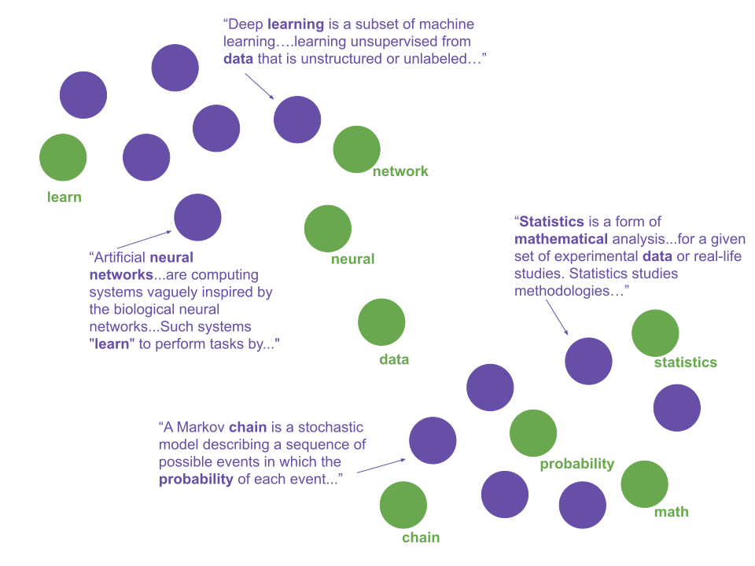
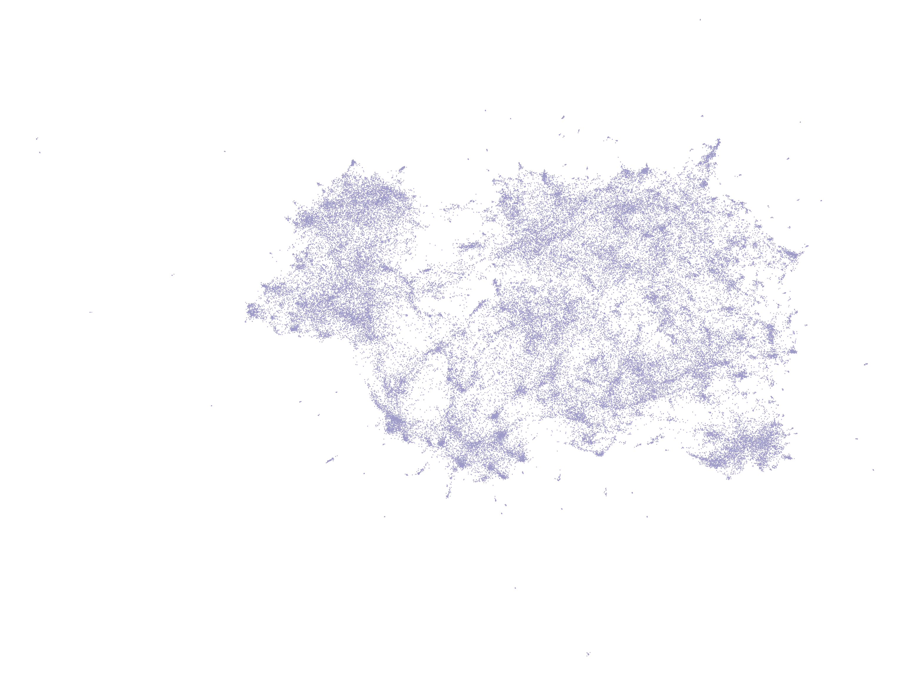
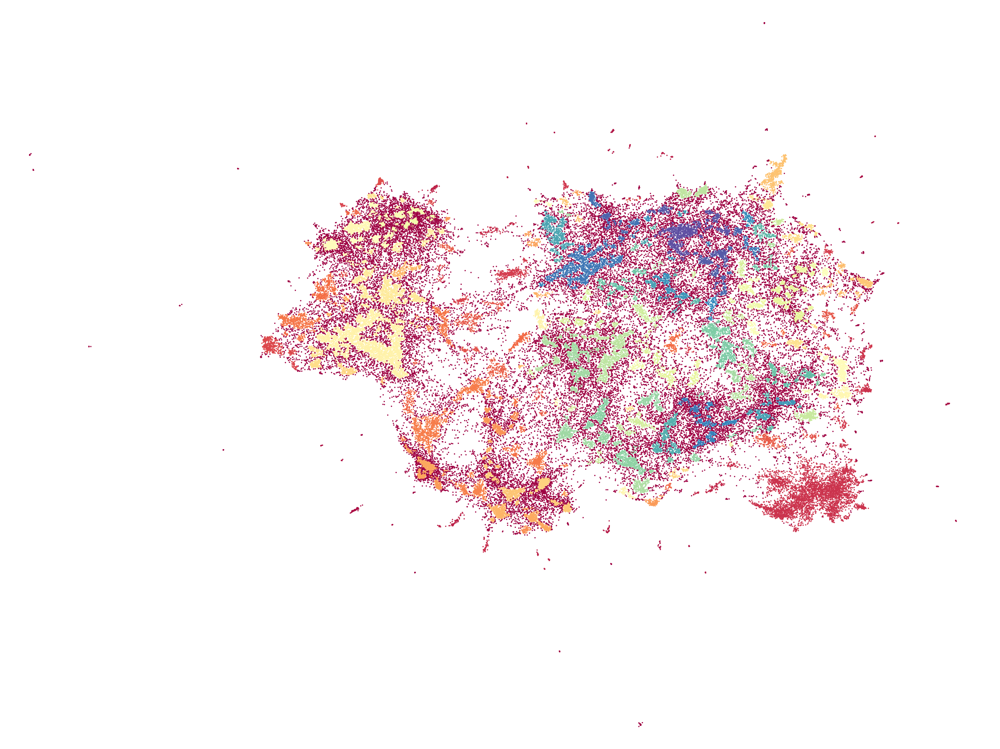

Top2Vec
=======

Topic2Vector is a an algorithm for topic modeling. It automatically detects topics present in text
and generates jointly embedded topic, document and word vectors. Once you train the Top2Vec model 
you can:
* Get number of detected topics.
* Get topics.
* Search topics by keywords.
* Search documents by topic.
* Find similar words.
* Find similar documents.

Benefits
--------
1. Automatically finds number of topics.
2. No stop words required.
3. No need for stemming/lemmatizing.
4. Works on short text.
5. Creates jointly embedded topic, document, and word vectors. 
6. Has search functions built in.

How does it work?
-----------------

The assumption under the algorithm is that many documents that are semantically similar 
are indicative of an underlying topic. The first step is to create a joint embedding of 
document and word vectors. Once documents and words are embedded in a vector 
space the goal of the algorithm is to find dense clusters of documents, then identify which 
words attracted those documents together. Each dense area is a topic and the words that
attracted the documents to the dense area are the topic words.

# The Algorithm:

**1. Create jointly embedded document and word vectors using [Doc2Vec](https://radimrehurek.com/gensim/models/doc2vec.html).**
>Documents will be placed to other similar documents and close to most distinguishing words. 

**2. Create lower dimensional embedding of document vectors using [UMAP](https://github.com/lmcinnes/umap)**
>Document vectors in high dimensional space are very sparse, dimension reduction allows the discovery of dense areas. 

**3. Find dense areas of documents using [HDBSCAN](https://github.com/scikit-learn-contrib/hdbscan)**
>The colored areas are the dense areas of documents. Red points are outliers that do not belong to a specific topic.

**4. For each dense area calculate centroid of document vectors in original dimension. (centroid = topic vector)**
**5. Find n-closest word vectors to the resulting topic vector**


Installation
------------

The easy way to install Top2Vec is:

    pip install top2vec


Usage
-----

```python

from top2vec import Top2Vec

model = Top2Vec(documents)
```
Parameters:

  * ``documents``: Input corpus, should be a list of strings.
  
  * ``speed``: This parameter will determine how fast the model takes to train. 
    The 'fast-learn' option is the fastest and will generate the lowest quality
    vectors. The 'learn' option will learn better quality vectors but take a longer
    time to train. The 'deep-learn' option will learn the best quality vectors but 
    will take significant time to train.  
    
  * ``workers``: The amount of worker threads to be used in training the model. Larger
    amount will lead to faster training.
